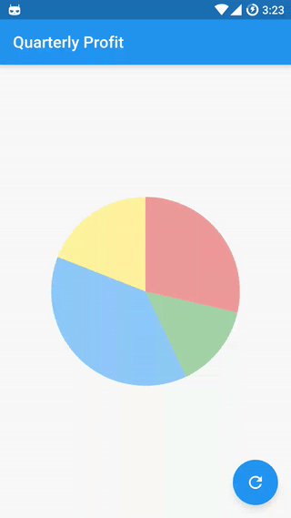
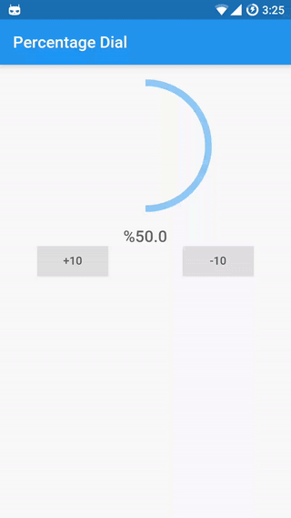
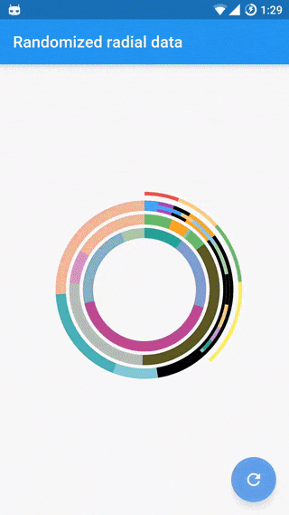

# Flutter Circular Chart

A library for creating animated circular chart widgets with Flutter, inspired by [Zero to One with Flutter](https://medium.com/dartlang/zero-to-one-with-flutter-43b13fd7b354).

## Overview

Create easily animated pie charts and radial charts by providing them with data objects they can plot into charts and animate between.





Check the examples folder for the source code for the above screenshots.

## Contents:
- [Installation](#installation)
- [Getting Started](#getting-started)
- [Details](#details)
  - [Chart data entries](#chart-data-entries)


## Installation

__Note:__ This is a WIP early implementation, use at your own risk. You can install it by including this git repository in your package dependencies:

```
  dependencies:
      flutter_circular_chart:
        git:
          url: git://github.com/xqwzts/flutter_circular_chart.git
```

## Getting Started

Import the package:

```
import 'package:flutter_circular_chart/flutter_circular_chart.dart';
```

Create chart data entry objects:

```
List<CircularStackEntry> data = <CircularStackEntry>[
  new CircularStackEntry(
    <CircularSegmentEntry>[
      new CircularSegmentEntry(500.0, Colors.red[200], rankKey: 'Q1'),
      new CircularSegmentEntry(1000.0, Colors.green[200], rankKey: 'Q2'),
      new CircularSegmentEntry(2000.0, Colors.blue[200], rankKey: 'Q3'),
      new CircularSegmentEntry(1000.0, Colors.yellow[200], rankKey: 'Q4'),
    ],
    rankKey: 'Quarterly Profits',
  ),
];
```

Create an `AnimatedCircularChart`:

```
@override
Widget build(BuildContext context) {
  return new AnimatedCircularChart(
    key: _chartKey,
    size: const Size(300, 300),
    initialChartData: data,
    chartType: CircularChartType.Pie,
  );
}
```

Call `updateData` to animate the chart:

```
void _cycleSamples() {
  List<CircularStackEntry> nextData = <CircularStackEntry>[
    new CircularStackEntry(
      <CircularSegmentEntry>[
        new CircularSegmentEntry(1500.0, Colors.red[200], rankKey: 'Q1'),
        new CircularSegmentEntry(750.0, Colors.green[200], rankKey: 'Q2'),
        new CircularSegmentEntry(2000.0, Colors.blue[200], rankKey: 'Q3'),
        new CircularSegmentEntry(1000.0, Colors.yellow[200], rankKey: 'Q4'),
      ],
      rankKey: 'Quarterly Profits',
    ),
  ];
  setState(() {
    _chartKey.currentState.updateData(nextData);
  });
}
```

## Details

### Chart data entries:

Charts expect a list of `CircularStackEntry` objects containing the data they need to be drawn.

Each `CircularStackEntry` corresponds to a complete circle in the chart. For radial charts that is one of the rings, for pie charts it is the whole pie.

Radial charts with multiple `CircularStackEntry`s will display them as concentric circles.

Each `CircularStackEntry` is composed of multiple `CircularSegmentEntry`s containing the value of a data point. In radial charts a segment corresponds to an arc segment of the current ring, for pie charts it is an individual slice.


